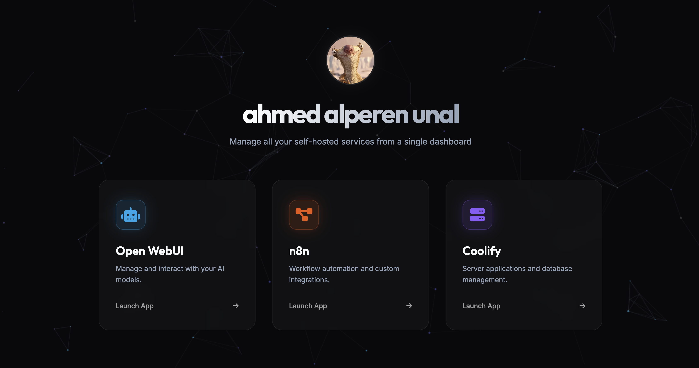

# Self-Hosted Services Dashboard 🚀

A modern, animated, and interactive homepage/dashboard designed to beautifully display and manage all your self-hosted web services from a single place.



## ✨ Features

- **Modern UI/UX**: Glassmorphism design with a sleek dark mode.
- **Dynamic Background**: Interactive "flowing dots" particle animation running smoothly on an HTML5 canvas.
- **Service Cards**: Quick access cards for your hosted tools with hover glow animations.
  - 🤖 **Open WebUI**: Manage and interact with your AI models.
  - 🔄 **n8n**: Workflow automation and custom integrations.
  - 🗄️ **Coolify**: Server applications and database management.
- **Responsive Layout**: Fully responsive grid that looks great on mobile, tablet, and desktop devices.
- **Custom Typography**: Utilizes modern Google Fonts (Inter & Outfit) for a clean, legible look.

## 🛠️ Technologies Used

- **HTML5** (Structure and semantic elements)
- **Vanilla CSS3** (Styling, custom properties, keyframe animations, glassmorphism)
- **Vanilla JavaScript** (Particle animation logic and canvas rendering)
- **Font Awesome** (Vector icons)
- **Google Fonts** (Inter and Outfit)

## 🚀 Getting Started

1. **Clone the repository:**
   ```bash
   git clone https://github.com/yourusername/your-repo-name.git
   ```
2. **Run the Dashboard:**
   Simply open the `index.html` file in your favorite web browser. No build tools or dev servers are required. Alternatively, you can use an extension like Live Server in VS Code.
   
3. **Customize Your Profile:**
   - Replace the `PP_01.png` file with your own profile picture.
   - Edit the name and description in the `<header>` section of `index.html` to fit your identity.
   
4. **Configure Your Services:**
   - Edit the `href` attributes in the `.service-card` anchor tags found in `index.html` to point to your actual local or web addresses (e.g., `http://openwebui.local`).
   - If you want to add or change services, simply duplicate a `<a class="service-card">` block, update the icon class from Font Awesome, and adjust the title and description.

## 🤝 Contributing
Contributions, issues, and feature requests are welcome!

## 📝 License

This project is open-source and available under the [MIT License](LICENSE).

---
*Note for GitHub: Please make sure to take a screenshot of your dashboard in the browser, name it `screenshot.png`, and place it in the root folder of this repository so it displays perfectly in this README!*
